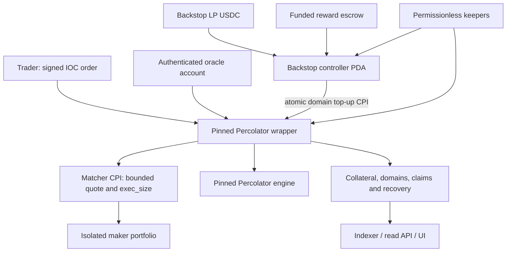

# Permissionless Perps with Dynamic JIT Backstop Capital

- **Updated:** 2026-09-12
- **Status:** Executable protocol thesis for a one-market devnet build; not an audit or mainnet approval.
- **Chain:** Solana
- **Risk engine:** current MVP pin is wrapper `5cb331dde354517c6371a8acf92cecb194f3bb73` with declared engine `4db11a8cb0053815e23a35d3a7d3edc265d8d866` (see `architecture/p1-upstream-reproduction.md`). The analysis below references the earlier `8eb7142`/`2b1d025` candidates; the cited functions exist at both.
- **Superseded in part (2026-09-30):** MVP scope, oracle, isolation and LP-yield decisions now live in `spec.md` and `execution-plan.md`; where this thesis differs, those documents win.
- **Benchmark:** Authenticated Colosseum Copilot project, winner, accelerator, and archive research, supplemented by current primary sources. Findings are bounded by the searches described below.

> A Solana perpetuals exchange for underserved, spot-liquid tokens: each eligible market has its own funded maker pool, explicit loss-bearing backstop, and exposure limits tied to what it can safely underwrite.

The architecture decision is **fully onchain, isolated pool-as-maker execution first**, conditional on reliable pricing and willing underwriters. Build a narrow matcher and a separate backstop controller around a pinned Percolator wrapper. Do not fork the risk math into a new accounting system, and do not make a CLOB the cold-start dependency. Add competitive maker adapters only when maker participation is demonstrated. This preserves onchain execution but does **not** satisfy the Foundation brief's separate preference for participant-driven price discovery.

Read alongside the [validation review](idea-validation-review.md), [execution plan](execution-plan.md), and [production requirements](spec.md). These documents define proposed behavior and release gates, not completed software, audits, or demand validation.

### Executable product in one sentence

A token graduates into a capped isolated perp only after oracle, spot-depth, manipulation-cost, capital and demand gates pass; traders send atomic IOC orders to an onchain inventory-aware pool; Percolator owns margin, liquidation and claim accounting; a market-specific USDC backstop can be deployed permissionlessly into the exact stressed source domain; the market automatically progresses from `NORMAL` to `GUARDED`, `REDUCE_ONLY` and `RECOVERY` before ADL is considered.

### What must exist for the first real demo

1. One admitted token/USDC market and one canonical oracle adapter.
2. Direct signed market and limit-IOC transactions; no persistent orderbook dependency.
3. A deterministic matcher with oracle band, inventory skew, size impact, fee, expiry, sequence and hard capacity checks.
4. Pinned Percolator engine/wrapper integration with ordinary deposits, domain backing, liquidation, impairment and recovery tested end to end.
5. A separate backstop vault whose funded USDC is not counted as active backing until a successful atomic top-up to the correct `(market, market_id, domain)`.
6. Permissionless cranks/liquidations/backstop activation, an indexer and read API, and UI that exposes executable capacity, oracle status, payout impairment and LP principal at risk.
7. Equal-capital simulations proving whether dynamic commitments beat a static reserve; if they do not, ship the static reserve and retain the controller only as research.

## 1. Problem and target users

A trader can correctly predict an extreme move yet receive less than the expected profit because losing counterparties cannot pay, liquidations fail, or the venue lacks executable liquidity. The motivating BCH/BTC tweet is a user-provided anecdote; its price claim has not been independently verified here.

Three problems need different responses:

- **Execution shortage:** no counterparty will fill a close at an acceptable price. Additional market makers or inventory can help.
- **Backing shortage:** recognized claims exceed the collateral that can support them. Someone must contribute loss-bearing capital, accept a haircut, or relinquish a claim.
- **Settlement delay:** collateral exists, but oracle freshness, account settlement, liens, or recovery rules prevent immediate withdrawal. Depositing more money does not necessarily remove these gates.

The initial customers are traders seeking long/short exposure to newly launched or low-cap tokens that lack a useful perp venue, and LPs willing to underwrite a specific market. Absence of an existing perp is a discovery filter, not a safety test or proof of unmet paying demand. Token issuers can help seed markets, but their participation is a hypothesis to validate.

Segment by spot-market maturity rather than market cap:

| Token condition | Product posture |
|---|---|
| Pre-graduation curve, no robust reference or exit depth | Observation/registration only; no conventional leveraged perp |
| Graduated but dependent on one thin or concentrated spot pool | Not eligible by default; graduation alone is insufficient |
| Established, defensible spot liquidity; no useful perp | Initial target, subject to oracle, manipulation, capital and demand gates |
| Established liquidity plus committed competitive makers | Candidate for RFQ or CLOB expansion |

Permissionless registration is not unconditional activation. Onchain-observable constraints must be enforced in the program; assessments such as venue independence and manipulation cost require a disclosed, versioned risk certificate initially. Its signers and expiry are trust assumptions, not magically trustless conclusions. No silent fallback from an expired certificate to unrestricted leverage.

## 2. The original idea, refined

**Original proposal:** when a vault is undercollateralized, an algorithm raises LP APY sharply; fresh JIT deposits restore H toward 1 so traders can exit.

**Recommended product:** an isolated pool-funded perp with a dynamic backstop experiment. Maker LP equity takes the other side of trades through bounded onchain quotes. Separately, backstop LPs commit USDC to a named market and term, earn a funded availability payment, and authorize deployment into eligible source-domain backing when a published stress threshold is reached. A capped deployment premium increases as backing becomes scarce. Ordinary maker equity, dedicated backing, undrawn commitments and reward escrow are not interchangeable capital balances.

The dynamic policy must outperform, or offer demonstrably better LP terms than, the **same money continuously allocated as static backing**. Moving already locked USDC between ledgers creates no new capital and may add activation delay. Static backing remains the baseline and the fallback if the dynamic policy has no economic advantage.

Trigger the mechanism **before** a shortfall, while H may still equal 1. Once claims have been haircut and extinguished, later deposits do not automatically recreate them. During an existing shortfall, new participation is explicit recapitalization with disclosed losses and terms.

The intended outcome is fewer or smaller payout impairments and more reliable exits. It is not a promise of zero ADL, guaranteed full profits, or guaranteed LP principal. Percolator's native recovery and loss-allocation rules remain the fallback.

## 3. Does depositing actually restore H?

### Use the selected engine's accounting

Earlier research in this repository mixes several Percolator generations and simplified global H formulas. The inspected engine identifies its specification as v16.9.1 and uses source-domain credit, with a domain corresponding to an asset and the side backing a claim. Its risk library does not itself provide token custody, oracle authentication, or a deployed Solana program. Those belong to the wrapper. [Percolator engine overview](https://github.com/aeyakovenko/percolator/blob/8eb7142aada316f6c476f5c4fa815d3a806706d5/README.md).

For intuition, define a normalized support ratio for domain d:

```text
H_d = 1                                      if D_d = 0
H_d = min(1, B_d / D_d)                       otherwise

B_d = eligible, available backing for that domain
D_d = the engine's positive-claim bound for that domain
```

In the inspected implementation, available source credit subtracts already encumbered backing and insurance from the relevant reserved stocks. It is not the token account's raw balance. Individual payout calculations additionally depend on existing liens, settlement, and lifecycle state; H_d is not a universal multiplier for every displayed PnL. See `available_backing_num_for_source_credit_state`, `expected_source_credit_rate_num_for_state`, and `account_source_realizable_support` in the [pinned engine source](https://github.com/aeyakovenko/percolator/blob/8eb7142aada316f6c476f5c4fa815d3a806706d5/src/v16.rs).

### Ordinary account deposits and backing deposits differ

An ordinary Percolator account deposit increases vault tokens and the depositor's capital by the same amount. It does not allocate that deposit to a source-domain backing bucket. The dedicated backing-deposit path does update that bucket and recompute its source credit. Insurance top-ups also need the correct domain allocation and reservation path before they can support a claim. These are materially different instructions, not interchangeable labels for adding TVL. See `deposit_not_atomic`, `deposit_fresh_counterparty_backing_not_atomic`, and `add_fresh_counterparty_backing_unchecked` in the [engine source](https://github.com/aeyakovenko/percolator/blob/8eb7142aada316f6c476f5c4fa815d3a806706d5/src/v16.rs).

An illustrative domain has $100,000 of eligible backing and $125,000 of outstanding claim bound: H_d = 0.80. An unrelated $25,000 account deposit leaves that backing unchanged. Allocating $25,000 of fresh, unencumbered backing to the correct domain could raise its ratio to 1, assuming claims and other state stay unchanged. That provider's money is now exposed to consumption by those claims.

**The economic constraint:** if $25,000 is consumed paying traders, the provider cannot also withdraw the same $25,000 unless another identified source replenishes it. A receipt token or promised future fees does not manufacture that replacement money. Variable-value LP shares can represent this risk; a fully redeemable senior balance cannot simultaneously count as loss-absorbing backing.

### Why a large APY headline is insufficient

At **1,000% simple annualized APR**, a $100,000 allocation earns approximately **$114 over one hour**, before losses and costs. This does not compensate a predictable $20,000 loss. APY implies compounding and should not be used interchangeably with APR.

The interface should show dollars available for the commitment period, remaining reward budget, principal at risk, and exit conditions. The feasibility question is whether fees can buy sufficient risk-bearing capital at a price LPs will actually accept.

## 4. Benchmark: what already exists and what could differentiate us?

### September 11 update: direct product overlap

- **derp.trade:** current documentation describes a Solana mainnet beta using an AMM for long-tail derivatives and separately discloses that realizable PnL can be limited by pool liquidity. This is direct segment and payout-risk overlap, not merely a historical hackathon match. [Overview](https://docs.derp.trade/), [position-value rules](https://docs.derp.trade/docs/protocol/value).
- **Perk:** its versioned documentation describes permissionless markets, a vAMM and a Percolator-derived risk engine. Its published security reviews are explicitly internal, not independent audits. Treat implementation and adoption claims as unverified here. [Introduction](https://docs.perk.fund/introduction), [security](https://docs.perk.fund/security).
- **Wasabi / Omnipair:** spot-backed leverage and isolated spot-margin pools are substitutes for users who want leverage on new tokens rather than synthetic perps specifically. They are different products; no claim of risk-free liquidation or drop-in Percolator compatibility is adopted. [Wasabi leverage model](https://docs.wasabi.xyz/_/overview/leverage-trade), [Omnipair overview](https://docs.omnipair.fi/).

These are primary documentation findings, not independent volume, solvency or audit verification. The proposed differentiation is **measurable payout resilience at a sustainable underwriting cost**, not being the first pool, first permissionless listing venue, first Percolator app, or first dynamic rate curve. See the review for demand gaps and rejection tests.

### September 12 protocol benchmark: Phoenix, Percolator-based venues, ORDR and Velocity

These products change the implementation bar, but none is a dependency unless explicitly pinned in the specification.

| Reference | Verified design signal | What we adopt | What we reject or defer |
| --- | --- | --- | --- |
| [Phoenix](https://docs.phoenix.trade/phoenix/matching-engine/matching-engine) | Its engine combines FIFO orders with risk-capped virtual spline liquidity; its liquidation ladder progressively cancels, partially liquidates, transfers to a backstop, then uses ADL last. | Sequence/expiry protection, side-specific risk capacity, progressive intervention and a future maker-adapter boundary. | A full FIFO book and Phoenix's multi-venue mark construction: our launch assets may have no independent perp venue, and a cold CLOB has no liquidity merely because orders are stored onchain. |
| [Percolator program](https://github.com/aeyakovenko/percolator-prog/tree/2b1d025c004f92d3f89bac00113be90a0cbbcf63) | The current wrapper separates pure risk accounting from custody/oracle/matcher policy and exposes domain-scoped insurance and backing top-ups, expiry, authority epochs, monotonic intent IDs, and loss/recovery ledgers. | Pin/fork this boundary, keep upstream changes small, use `TradeCpi`, and build the controller as the configured backing authority. | Reimplementing Toly's risk math or tracking `main`. Upstream explicitly labels the code educational and unaudited, so reproduction, review and audit remain mandatory. |
| Existing Percolator-based venues | Permissionless long-tail Percolator markets with isolated risk and oracle-derived or virtual (vAMM) liquidity already exist. | Validate market-admission quality plus payout resilience as the basis for any differentiation. | Claims that we are the first permissionless long-tail Percolator venue. Permissionless creation is not differentiation. |
| [ORDR](https://ordr.trade/) | Its published architecture uses per-maker private orderbook accounts, reference-price offsets and JIT execution to reduce shared-account contention. | Reserve a versioned maker-adapter ABI and make future quote contexts isolated per maker. | An MVP CLOB and dependency on unpublished protocol code. The public CHA0S-LABS repository found in this review is a landing site, not the exchange program. |
| [Velocity](https://docs.velocity.exchange/protocol/how-it-works/orderbook-and-keepers) | Onchain orders can be filled by permissionless keepers using maker, JIT and AMM sources; its wind-down flow makes reduce-only, expiry and settlement explicit. | Permissionless bots with onchain validation, staged wind-down and later trigger/TWAP order support. | Cross-margin plus lending in the same first release, and reliance on its archived public Drift-derived repository as current Velocity source. |

Recent public Phoenix updates add [TWAP execution](https://x.com/PhoenixTrade/status/2097750106124513637), [new markets](https://x.com/PhoenixTrade/status/2097771106077737347), wallet distribution and [agent/CLI tooling](https://x.com/PhoenixTrade/status/2094526578537455919). The product lesson is that a meaningful perp is an integrated protocol, SDK, keeper/indexer and distribution surface—not only a risk formula. Social updates are directional evidence; protocol requirements come from code and documentation. [Phoenix X](https://x.com/PhoenixTrade), [ORDR X](https://x.com/ordrtrade), [Velocity X](https://x.com/VelocityDEX).

### September 9 technical and historical benchmark

The following records preserve the earlier research. References to proposed participant-driven execution describe that earlier comparison; the current launch architecture is defined in section 5.

As of 2026-09-09, the reviewed primary sources establish meaningful overlap. They do not establish that the proposed combination is unique.

- **Percolator itself — closest technical overlap.** The current source already implements `backing_utilization_rate_e9_for_source_state`, including a base rate, a kink, and a steeper slope above the kink. Adding a utilization-based interest curve is therefore not, by itself, a new Percolator feature. The proposed addition is the commitment, deployment, reward-budget, and LP-accounting policy around capital availability. [Engine implementation](https://github.com/aeyakovenko/percolator/blob/8eb7142aada316f6c476f5c4fa815d3a806706d5/src/v16.rs).

- **Percolator Meta — closest incentive/accounting reference.** This experimental project already combines at-risk market insurance participation, owner-bound capital accounting, and reward distribution. Reuse the lessons about tenure, realized loss, and constrained custody; an insurance staking wrapper alone is a weak differentiation claim. Its governance bootstrap is not evidence that a seconds-to-minutes stress deployment mechanism works. [Percolator Meta](https://github.com/aeyakovenko/percolator-meta/blob/d1a147cc36d3302fc2115d77a8adae7b4fa87241/README.md).

- **Perennial via Kwenta — closest economic precedent.** Kwenta documents Perennial's utilization-based maker interest, with sharply increasing rates above a target. This is direct prior art for the proposed interest-rate intuition. It does not establish automatic restoration of impaired Percolator claims. [Kwenta's Perennial interest-rate documentation](https://docs.kwenta.io/using-kwenta/perennial-isolated-margin/perennial-intro/interest-rate).

- **Drift JIT — closest execution precedent.** Drift's published design lets competing makers fill a taker's order through a short auction before an AMM backstop. That is JIT trade execution. Our capital mechanism concerns collateral backing and underwriting; the two can coexist, but solving one does not solve the other. This is a mechanism comparison, not a recommendation to integrate or a claim about current protocol health. [Drift's JIT design](https://www.drift.trade/updates/jit-liquidity-mechanism).

- **ADL research — conceptual constraint.** Tarun Chitra's paper studies the tradeoffs between solvency, fairness, and exchange revenue when loss socialization is necessary. Our design changes the availability and timing of external capital; it does not eliminate the need to allocate losses when capital is insufficient. This is an inference from the paper's framing, not a result proved for our mechanism. [Autodeleveraging: Impossibilities and Optimization, v3](https://arxiv.org/abs/2512.01112v3).

**Defensible differentiation hypothesis:** market-specific, precommitted backstop capital deployed permissionlessly under verifiable stress conditions, with rewards limited to funded budgets and performance measured against equally funded alternatives.

**Current assessment:** a useful protocol-design experiment with substantial existing primitives. Novelty of the rate curve is low; novelty and usefulness of the integrated capital policy remain unproven. The difficult work is LP economics, accounting, and execution reliability, not drawing the curve.

### Colosseum Copilot: similar builder projects

These are historical submission records retrieved on 2026-09-09. Mechanism descriptions are project claims or corpus summaries, not independently verified production deployments. Hackathon dates come from the API's `hackathon.startDate`; prize and cohort labels come from returned metadata.

- **[Perc-o-dex](https://colosseum.com/projects/explore/perc-o-dex)** — `perc-o-dex`; Cypherpunk, September 2025. Its submission describes a sharded perpetual exchange forked from aeyakovenko. **Overlap:** building a Solana perp on Percolator. **Our proposed difference:** funded, stress-triggered backing deployment with LP loss accounting. The inspected record does not establish that feature. Being a Percolator fork is already represented in the corpus.

- **[derp.trade](https://colosseum.com/projects/explore/derp.trade)** — `derp.trade`; Breakout, April 2025. The search record describes AMM-based leveraged perps for low-liquidity tokens and synthetic assets. **Overlap:** the proposed asset segment and trading use case. **Our proposed difference:** participant-driven execution and an explicit backstop-capital policy. “Perps for illiquid tokens” is insufficient differentiation on its own.

- **[Uranus DEX](https://colosseum.com/projects/explore/uranus-dex)** — `uranus-dex`; Cypherpunk, September 2025. Its submission proposes peer-to-peer permissionless prediction perps for assets from mint. **Overlap:** early-token access and peer-to-peer execution. **Our proposed difference:** Percolator domain backing and measured settlement outcomes. The submission does not establish identical contract payoffs, margin rules, or loss accounting, so treat it as a market-access reference rather than assume interchangeable products.

- **[Squeeze](https://colosseum.com/projects/explore/squeeze)** — `squeeze`; Radar, September 2024; **1st Place, DeFi**. The detailed submission describes lending developer-seeded liquidity positions to enable long/short leverage from launch. **Overlap:** creator-seeded capital, new-token leverage, and liquidation concerns. **Our proposed difference:** a market's dynamic commitment and backing-deployment policy. Creator seeding is a useful component, but this record rules out presenting that component as an untouched idea.

- **[Archer Exchange](https://colosseum.com/projects/explore/archer-exchange)** — `archer-exchange`; Cypherpunk, September 2025; **4th Place, DeFi; accelerator C4**. Its submission describes dual flow batch auctions intended to reduce maker adverse selection and latency competition. **Overlap:** onchain auction execution and maker incentives. **Our proposed difference:** funding the risk behind settlement. Archer is an execution-design reference; a quote auction alone is not the novel part of our proposal, and our MVP does not claim to implement Archer's mechanism.

- **[InsureOS](https://colosseum.com/projects/explore/insureos)** — `insureos`; Renaissance, March 2024. Its detailed submission proposes competing liquidity pools underwriting codebase risk for recurring premiums. **Overlap:** paying LPs to accept a defined loss exposure. **Our proposed difference:** observable perp backing stress and a constrained deployment path, rather than smart-contract vulnerability coverage. This is a useful precedent for making the insured event, premium payer, and loss bearer explicit.

- **[Reflect Protocol](https://colosseum.com/projects/explore/reflect-protocol)** — `reflect-protocol`; Radar, September 2024; **Grand Prize; accelerator C2** under Reflect Money. Its submission describes autonomous hedging and responses to funding and OI metrics. **Overlap:** capital automation driven by risk state. **Our proposed difference:** underwriting a market's claim support, rather than a delta-neutral currency/carry strategy. Automated risk scores are not a substitute for proving the backing allocation and its economic return.

**Winner and accelerator checks:** both filtered searches returned relevant adjacent work. The accelerator results included Archer and Reflect; the winner results included Squeeze and Archer, as well as honorable mentions. Prize metadata does not prove current adoption or mechanism safety. These findings establish component-level precedent; they do not prove that the exact proposed combination has or has not been built elsewhere.

### Archive insights that affect the design

- **Insurance is already a capital product.** Copilot's archived *Liquidation Engine – Drift Protocol* describes fee-earning insurance stakes, limits on perp coverage, and a fallback to market-level socialized losses when the available protections are exhausted. Our contribution must improve the timing or allocation of scarce backing; staking into an insurance pool is existing practice. [Archived source, dated February 2026 in Copilot](https://docs.drift.trade/protocol/trading/liquidations/liquidation-engine).

- **Execution JIT depends on willing, operational makers.** The archived *Just-in-Time (JIT) FAQ* separates JIT makers, resting orders, and AMM liquidity, and discusses the infrastructure needed to land fills. It also distinguishes liquidation processing from the trade JIT auction. Our inference: a high capital reward cannot be treated as a guaranteed fill, and deployment latency must be measured alongside LP willingness. [Archived JIT FAQ, dated February 2026 in Copilot](https://docs.drift.trade/protocol/about-v3/jit-faq).

- **Risk controls and more capital address different failure modes.** The archived liquidation discussion describes partial liquidation and oracle guardrails as well as insurance. Our design should test these dimensions separately; it should not attribute fewer losses to the capital controller if the experiment also changes liquidation rules. This does not endorse importing Drift's numerical parameters into a new-token market. [Liquidation-design source](https://docs.drift.trade/protocol/trading/liquidations/liquidation-engine).

### Benchmark verdict and research coverage

- **Problem relevance:** credible protocol failure mode, supported by liquidation/insurance documentation; demand for this specific product remains unvalidated.
- **Novelty:** low for an APY spike, creator seed, a Percolator fork, or an auction considered individually. Potential differentiation is the combined commitment, deployment, and funded-reward policy. Based on the available data, originality of that combination is not established.
- **Build feasibility:** suitable for a narrow simulator and devnet prototype. The current Anchor scaffold and the unverified wrapper integration do not support calling the complete exchange an easy implementation.
- **Best next proof:** demonstrate fewer payout impairments and acceptable LP net returns against native-rate and static-reserve baselines with equal capital. This is a stronger claim to test than “very high APY attracts liquidity.”

Coverage: six project searches (`Percolator`; three mechanism/market searches; separate winner and accelerator searches), six detailed project records, two archive searches, and two complete archive documents. The `Percolator` entity search found Perc-o-dex; tangential semantic matches were excluded. Several searches reported additional results beyond the returned page, so this is a targeted benchmark rather than an exhaustive corpus audit. Scores and cluster sizes were not interpreted as uniqueness or market-size measurements. Authentication succeeded, and the API reported skill version `1.2.1`, matching the loaded skill.

## 5. Recommended architecture

**Use three onchain responsibilities: a pinned Percolator wrapper, a minimal matcher, and a backstop controller.** Start with one eligible token market and USDC collateral. The matcher quotes a real-capital maker account; the controller owns funded standby capital and is the wrapper's constrained domain-backing authority. This is a conditional product-fit hypothesis, not evidence that the pool is safe or profitable.

Pricing, margin accounting, and capital sourcing remain separate decisions. A deterministic pool quote uses an authenticated reference price plus bounded size, inventory and risk adjustments. It is not independent two-sided price discovery. It must refuse trades beyond its capacity; a formula that returns a price does not guarantee a payable exit.

### Why this model

- **Isolated, real-capital pool — recommended bootstrap:** one funded allocation can quote without waiting for outside makers. LPs knowingly absorb directional losses. Safe reference pricing, finite exposure, capital sufficiency and acceptable net LP returns are hard admission gates, not later enhancements.
- **Full onchain CLOB:** strong participant-driven price discovery and familiar trading behavior. It also requires persistent two-sided makers, order reservations, cancellation semantics, partial-fill accounting, and a larger execution implementation. It does not cure bad debt by itself.
- **Competitive quote auction — conditional extension:** suitable when independent makers commit capital and demonstrate useful quote coverage. It does not solve cold-start underwriting. Adding it later must not systematically route benign flow to makers and toxic residual flow to the pool.
- **Virtual AMM:** virtual reserves provide a pricing rule, not assets that can pay profits. Do not choose this model because it appears to create free liquidity.
- **Spot-backed leverage:** a separate pivot if customers mainly want leveraged spot exposure. It requires actual lendable assets, executable exits and loss accounting; it is not this Percolator perp MVP.
- **Offchain matching with onchain settlement:** usable in other products, but does not meet the fully onchain execution objective here.

The Foundation's June 2026 brief includes orderbooks and genuinely competitive RFQ but excludes pool-based price formation from its stated pricing preference. **The recommended pool preserves onchain execution, not alignment with that entire brief.** If participant-driven pricing is non-negotiable, narrow launch markets to those with actual competing makers, or pursue the backstop as complementary infrastructure. Do not relabel one pool as maker competition. [Solana Foundation's brief](https://solana.com/news/build-onchain-perps).

No other perp venue does not mean hedging is impossible: a pool short against customer longs can buy spot; a pool long against customer shorts can sell owned inventory or borrow and sell tokens. Neither hedge is free or guaranteed executable. Automated spot hedging and underlying-token collateral are outside the first MVP; **no hypothetical hedge counts toward its risk capacity**. Finite USDC cannot guarantee payment against arbitrarily large upward gaps in net customer longs.

### Logical components



The engine is linked Rust inside the wrapper, not a CPI target. The application-owned deployables are initially the matcher and backstop controller; use a minimally modified, reproducibly built wrapper fork rather than a second risk system. The wrapper remains authoritative for custody, oracle authentication, margin, liquidation, backing and recovery.

### MVP account and execution boundaries

- **Market:** one independently funded risk instance per traded token, denominated in USDC; no cross-market margin or shared rescue pool initially. Keep the two source-side allocations explicit so the same dollar is not pledged twice. Use per-market writable accounts to avoid a global execution lock.
- **Trading capital:** the maker pool takes trading exposure and earns spread/fees. Trader margin, maker equity, native source backing, undrawn reserve and reward escrow have distinct ownership and obligation ledgers. Pending redemption remains loss-bearing until settled but is excluded from admitting new risk.
- **Backstop capital:** a PDA controller is the configured backing/insurance authority. LPs receive loss-aware shares in controller epochs, not unrestricted access to the native withdrawal authority. At the candidate wrapper pin, `TopUpBackingBucket` validates market generation, authority epoch, monotonic intent, fee policy, live domain and future expiry before updating source backing and transferring collateral in the same transaction. The optional upstream domain ledger exposes separate monotonic realized-loss and recovery counters; the controller snapshots and reconciles them rather than inventing loss accounting. [Pinned wrapper source](https://github.com/aeyakovenko/percolator-prog/blob/2b1d025c004f92d3f89bac00113be90a0cbbcf63/src/v16_program.rs).
- **Execution:** begin with atomic market and limit-IOC transactions using a fresh eligible observation, user price/fee limits, expiry, reserved capacity and one-shot sequence. The wrapper must settle the matcher's returned `exec_size`, never the requested size. Persistent intents, trigger orders, TWAP, partial-fill aggregation, competitive auctions and a CLOB are later extensions; this removes an unnecessary keeper/cancellation race from the first trade path.
- **Oracle:** authenticating a feed and choosing an execution price are separate operations. Apply feed identity, freshness, confidence, normalization and source-quality checks. A pool quote, self-trade or inventory adjustment must not replace the liquidation index. An oracle publisher quorum observing the same thin pool is not independent market liquidity. Valid large moves and invalid data require different responses.
- **Enforcement:** OI caps, fees, and market lifecycle rules must apply to every reachable risk-increasing entrypoint. Keeping them only in the frontend or an optional wrapper permits bypass. Adapt the Solana wrapper where necessary while preserving the pinned engine's accounting.
- **Keepers:** anyone can submit authenticated updates, execute eligible intents, crank accounts, liquidate or trigger eligible deployments. Bots propose; programs validate. API/indexer failure must not transfer authority over custody or prices to a server. Price-dependent reductions and liquidation remain subject to valid-price and capacity rules even during a pause.

**Security coupling:** backstop money can increase an oracle attacker's obtainable payout. Capacity must account for reachable reserve and rewards in the extraction surface and be tested against conservative net manipulation cost. A larger rescue fund cannot compensate for an economically unsafe oracle.

## 6. Backstop mechanism specification

### State sequence

1. **Commit:** an LP deposits into a market-specific commitment record, chooses supported terms, and accepts the maximum principal exposure, minimum commitment duration, reward rules, and settlement restrictions. Unfunded pledges do not count.
2. **Observe:** an onchain instruction reads fresh engine state and computes a conservative stress requirement. It measures eligible backing, outstanding claims, incremental gap losses, and executable close capacity. H_d = 1 alone is insufficient because it hides how little surplus remains.
3. **Activate:** once the threshold is met, any caller can move committed capital through the authorized domain backing/insurance path. Deployment and accounting updates are atomic where the selected wrapper permits them; multi-step paths must fail closed until complete.
4. **Accrue:** pay a modest funded availability reward while capital is committed and a capped premium for actual time at risk after deployment. Additional emergency entrants may participate under the same published rules.
5. **Settle:** losses reduce LP principal; collected revenue and recoveries accrue to their designated owners. Pay rewards from the separate escrow. Recompute eligibility before every redemption.
6. **Release or resolve:** release only unencumbered, loss-adjusted principal after the commitment period and native settlement checks. A commitment duration is a minimum lock, not a guarantee of redemption at that exact time. Unresolved exposure follows a defined wind-down path.

The first version should use one fixed commitment format and one market. Cross-market automatic reallocation would reintroduce correlated demand and capital-allocation complexity.

### Candidate stress curve

The following is a proposed controller model, not an upstream API or calibrated production rule:

```text
T_d = required backing under a published stress scenario
      (includes current claim obligations; do not count them twice)
B_d = currently eligible active backing for that requirement
q_target = max(0, T_d - B_d)
u = T_d / max(B_d, epsilon)

x = clamp((u - u_start) / (u_critical - u_start), 0, 1)
r_target = r_base + (r_cap - r_base) * x^2
```

Treat zero backing as a distinct activation/no-new-risk state, not an exploitable numerical epsilon. Public parameters must be calibrated against jump size, liquidation latency, and available liquidity. A real price gap can exceed any selected scenario.

Reuse native backing fees where their semantics fit. An extra stress-based controller, availability payment, or deployment premium must have its own ledger and authorization; do not assume a native per-slot borrower charge automatically implements an LP reward contract.

For a fixed offer covering an eligible amount A over a duration tau:

```text
offered_reward <= unreserved_funded_reward_budget
r_offer <= min(r_target, unreserved_budget / (A * tau_years))
```

Reserve the full obligation when accepting the commitment. Existing promises cannot be diluted by later deposits. If rewards are variable instead, state that clearly and only accrue what the available budget can fund. When the budget is exhausted, stop new offers; never create an unfunded liability to maintain the advertised rate.

### Who pays and who loses?

- Fund the initial reward escrow with creator capital or an explicit, capped bootstrap allocation; refill it from collected trading/backing fees. Prospective volume and uncollected interest are not cash.
- Charge capital costs transparently and distinguish them from directional funding between traders. Raising fees on distressed accounts can worsen the shortfall, so stress handling must not depend on unlimited new charges.
- Preserve Percolator's native loss waterfall. The new LP contract owns the economic consequences of its selected backing/insurance allocation; it must not secretly claim seniority over trader collateral or other domains.
- Known deficits require explicit loss acceptance or a separately negotiated recapitalization. They are not hidden in ordinary LP share minting. Mark existing losses before minting or redeeming shares; use a separate accounting epoch if needed.
- Keep ordinary committed LPs eligible for availability compensation. Paying only last-second entrants encourages existing liquidity to leave and return for subsidies.

### Minimum adversarial protections

Reward funded, useful capital over time rather than a transient deposit or raw volume. Prevent deposit-withdraw loops and repeated rewards for the same capital. Authenticate stress inputs; cap rebates and emergency allocations; use activation/deactivation hysteresis. A wallet blacklist cannot solve attackers splitting across addresses: the economics must make manufacturing stress or wash trades unprofitable after costs.

Do not pause liquidation or relax oracle checks to wait for a deposit. If no capital arrives, continue native risk reduction and recovery. H_d returning to 1 is only one necessary condition for some exits; executable quotes, account freshness, and settlement constraints still apply.

## 7. Additional features worth including

Keep additions focused on steep moves and ADL/payout impairment. The objectives are to reduce uncovered exposure before a jump, make liquidation execution more reliable, and prevent backing from disappearing during stress. These are proposed mechanisms and adaptations; first-ever novelty is not established.

### 7.1 Voluntary deleveraging rebates — strongest complementary feature

When a market approaches its backing limit, offer a funded rebate for a filled position reduction that lowers its conservative stressed loss requirement. Start with a simple capped rebate schedule; auctioning these reductions can be a later optimization.

**Use case:** a crowded market is approaching a point where another sharp move would overwhelm its backing. Some traders may voluntarily reduce exposure for a small payment, reducing the amount of capital the protocol must attract.

**ADL effect:** can reduce the future shortfall and the amount of forced position reduction required. It does not erase existing losses or ensure that a close can execute. Show the trader's net payout, including any current impairment, before accepting the close.

**Implementation boundary:** reuse the execution path and reward escrow. Pay only after the engine confirms the trade and a reduction in the relevant stress requirement. A close is not automatically beneficial: the effect depends on the remaining portfolio and counterparties. Prevent self-trading/reopening loops, double rewards, and subsidies exceeding the measured benefit. Complexity is moderate because incentive abuse must be tested.

### 7.2 Gap-aware OI capacity — simplest preventive control

Set per-side and gross OI limits so the market's modeled uncovered loss under a published price-gap scenario fits its dedicated loss-bearing capital. Recompute new-risk capacity as backing, prices, and pending withdrawals change. Creator seed supplies the initial budget.

**Use case:** a newly popular token attracts one-sided leverage much faster than backstop capital grows. The market stops accepting additional exposure before it reaches a dangerous imbalance.

**ADL effect:** limits the liabilities a jump can create. Net skew alone is insufficient because balanced OI can still produce counterparty defaults. A jump larger than the chosen scenario can still exhaust capital.

**Implementation boundary:** enforce admission checks at every risk-increasing entrypoint. Preserve supported reductions and collateral additions. Do not trigger liquidation of existing accounts solely by lowering the permitted opening leverage. This is essential risk policy, not a standalone novelty claim.

### 7.3 Urgency-based keeper rewards — target failed-liquidation latency

Increase the reward for a completed, useful liquidation/crank when a valid account's margin headroom becomes small. Use a few deterministic tiers and a capped, prefunded keeper budget. Pay for actual progress once, not for repeatedly calling an instruction.

**Use case:** during a rapid move or congestion, a routine keeper reward no longer covers the cost and risk of landing a transaction promptly.

**ADL effect:** can improve the chance of reducing a losing position before it becomes bad debt. It cannot create a liquidator counterparty or guarantee block inclusion. Charging the entire premium to an already insolvent account would worsen the problem, so the funding source must be explicit.

**Implementation boundary:** authenticate prices, tie payment to verified state progress, and test deliberate creation of near-liquidation accounts to farm rewards. Reuse native liquidation paths; do not delay liquidation to await a rebate buyer or backstop deposit.

### 7.4 Withdrawal-aware backing reservations — prevent an LP run from raising exposure

When an LP requests redemption, exclude the earmarked capital from capacity for new risk. Keep existing liens respected until they settle; release only the provider's loss-adjusted, unencumbered principal. Publish the commitment period and wind-down rules before deposit.

**Use case:** existing LPs begin leaving while traders continue opening positions against an apparently unchanged vault balance.

**ADL effect:** reduces reliance on capital already scheduled to exit and makes the JIT commitment credible. It does not repair an existing deficit, and an indefinite discretionary withdrawal freeze is not an acceptable replacement for a defined recovery path.

**Implementation boundary:** this belongs in the core capital ledger. The engine already constrains native backing withdrawals; the added policy connects pending redemptions to future risk admission.

### 7.5 One stress budget for adding backing or reducing exposure — later experiment

Once the first four mechanisms work, compare the cost of attracting an additional dollar of usable backing with the cost of releasing a dollar of required backing through voluntary reductions. Allocate a capped response budget using the same stress scenario and settled state for both measurements.

For example, if $40 of rebates releases $10,000 of modeled backing requirement while an extra $10,000 of committed capital would cost $100 over the same horizon, test whether the voluntary reduction is the better response. These figures illustrate the decision; they are not calibrated market prices. Future exposure, settlement costs, and lost fee revenue still matter.

This is the clearest extension of the flagship idea: buy additional backing and voluntary risk reduction through one measurable policy. Begin with fixed budget allocations in the simulator; do not claim an optimal controller or an ADL reduction until the experiments support it.

**Supporting requirements:** effective-exit quotes must separate execution price, fees, supported cash payout, and remaining claims. Market activation and wind-down must enforce oracle/seed requirements and native recovery. These improve transparency and contain failures; they do not count as new anti-ADL mechanisms by themselves.

**Suggested sequence:** implement gap-aware capacity and withdrawal accounting with the flagship backstop; then add voluntary reduction rebates and urgency rewards. Test shared budget allocation last. Avoid adding a governance token, a replacement ADL allocation algorithm, cross-market credit, or an options layer to this MVP.

## 8. MVP and architecture handoff

**Build objective:** demonstrate that a funded commitment-and-deployment policy improves payout and exit outcomes over a baseline, with comparable total capital and acceptable net returns for LPs.

**First deliverable — validation and simulator:** identify eligible target tokens and prospective traders/underwriters, then simulate one market with explicit long/short positions, all capital partitions, source-domain support, delayed liquidations and configurable LP participation. Compare static backing with dynamic activation under identical capital and reward budgets. Include permanent repricing and manipulation, not just reversible wicks.

**Second deliverable — localnet mechanism:** one eligible market, direct signed IOC execution through the LP-scoped matcher, one commitment format, funded reward escrow, atomic authorized domain deployment, upstream loss/recovery synchronization, loss-aware redemption and permissionless keepers. A synthetic test feed is allowed only in clearly marked local/devnet fixtures, never as evidence of mainnet eligibility.

**Third deliverable — public devnet MVP:** reproducible deployment, published risk parameters and trust assumptions, degraded-state demonstrations, independent review, and measured end-to-end results. Broader market activation and any real-money mainnet pilot are separately gated. Inherited engine proofs do not cover newly written custody, pricing or incentives.

Before implementation, make these interfaces concrete:

- Does candidate pair engine `8eb714…` plus wrapper `2b1d025…` reproduce and pass the full compatibility matrix, or which exact reviewed pair replaces it?
- Which native paths allocate backing, reserve insurance credit, settle claims, account for recoveries, and authorize withdrawals?
- How do LP ownership records reconcile deposits, consumed principal, fee income, recoveries, and outstanding reward obligations?
- What are the IOC quote, sequence, expiry, partial-fill, matcher-response, settlement and native funding rules?
- Which stress scenario sets OI capacity, and what happens when oracle quality or keeper liveness fails?
- Which authorities can update parameters, pause new risk, or upgrade code? What prevents their control from becoming an unrestricted withdrawal key?

The current research candidates are engine `8eb7142aada316f6c476f5c4fa815d3a806706d5` and wrapper `2b1d025c004f92d3f89bac00113be90a0cbbcf63`. The wrapper now exposes the domain and matcher primitives this design needs, but it is explicitly educational and unaudited. These hashes become dependency pins only after their manifest relationship, reproducible build, upstream suite and application integration tests pass. [Wrapper repository](https://github.com/aeyakovenko/percolator-prog/tree/2b1d025c004f92d3f89bac00113be90a0cbbcf63).

The ideation repository's Anchor counter scaffold was intentionally not migrated because it was not an existing perp implementation. Keep the first production interface aligned with the chosen upstream ABI rather than copying pseudocode from earlier research.

## 9. How to benchmark the mechanism fairly

**Economic baselines:** static backstop; native utilization-based fees; reactive JIT deposits after stress; and the proposed precommitted deployment policy. Hold total available capital and incentive budget constant, or report the extra capital explicitly. Otherwise reserve size can masquerade as better mechanism design.

**Stress scenarios:** a sharp wick and reversal; a permanent jump; one-sided OI; simultaneous stress in several isolated markets; stale or manipulated oracle inputs; delayed keepers/transaction inclusion; exhausted rewards; no new LP arrivals; and an LP withdrawal wave. Include a scenario that overwhelms the reserve and demonstrate the fallback.

**Report together:** frequency and duration of H_d < 1; actual trader payout shortfall; forced position reduction; time and slippage to close; time to redeem profit; LP realized net return and principal drawdown; subsidy per dollar of impairment avoided; capital deployment latency; and transaction compute/account requirements.

**Accounting/integration gates:** ordinary deposits must not falsely improve domain support; correctly allocated backing should improve support under a controlled unchanged-claims scenario; spent backing must not remain withdrawable; rewards must never exceed funded allocations; neither side nor another market may reuse the same backing; extinguished claims must not be paid twice; all valid exits and fallback paths must reconcile tokens and claims. Use property tests plus LiteSVM or equivalent integration checks against the selected program binary.

**Commercial gate:** identify actual traders and underwriting LPs, obtain acceptable fee/lock/loss terms, and show the reward budget can support them under plausible collected fees. Independent makers are an additional gate for auction/CLOB expansion, not a fictional dependency satisfied by one pool. The motivating tweet, competitor presence and a simulator do not establish demand for this product.

Proceed to implementation of a limited prototype once the accounting path is demonstrated. Rework the mechanism if improvement disappears after equalizing capital budgets, or if LP losses systematically exceed feasible compensation.

## 10. Relationship to prior research and skill workflow

- [Perpetual-futures literature review](research/perp-futures-literature-review.md): background for alternative mathematical models, not requirements for this MVP. A separate psi monitor is not established as equivalent to native claim support.
- [ADL comparison](research/adl-vs-percolator.md): useful motivation; its global H explanation is not the implementation specification for current v16.
- Superseded wrapper sketches, replacement-engine proposals, EVM feasibility work, early ideation, and the chat export remain in the ideation repository. They were intentionally excluded from this workspace so stale architecture is not treated as current requirements.

`navigate-skills` selected the installed `build-defi-protocol` guidance for custody, oracle policy, checked accounting, and invariant testing. Its external catalog JSONs were not available in the documented locations. `colosseum-copilot` supplied the authenticated builder comparisons and archive evidence, narrowing the pitch from generic dynamic yield to a specific, testable capital policy.

The September 11 review applies `validate-idea` to separate opportunity evidence from actual demand, and `build-defi-protocol` to define custody, oracle, testing and release requirements. Follow the [execution plan](execution-plan.md) and [specification](spec.md); the local handoff files record proposed decisions only. No completed perp implementation, production audit or new deployment is asserted.
